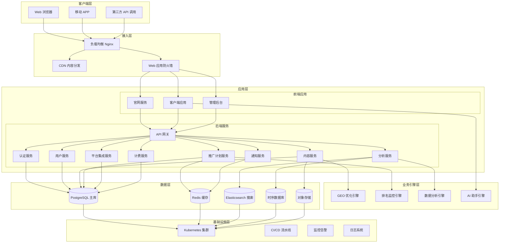
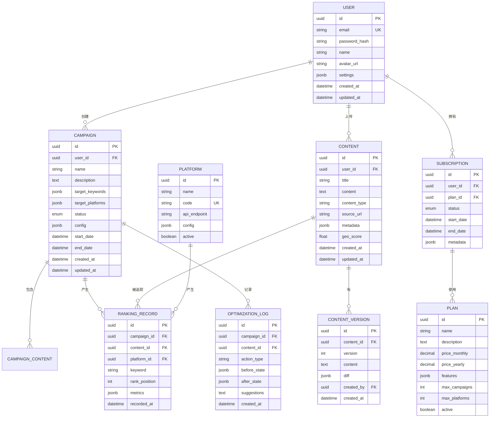
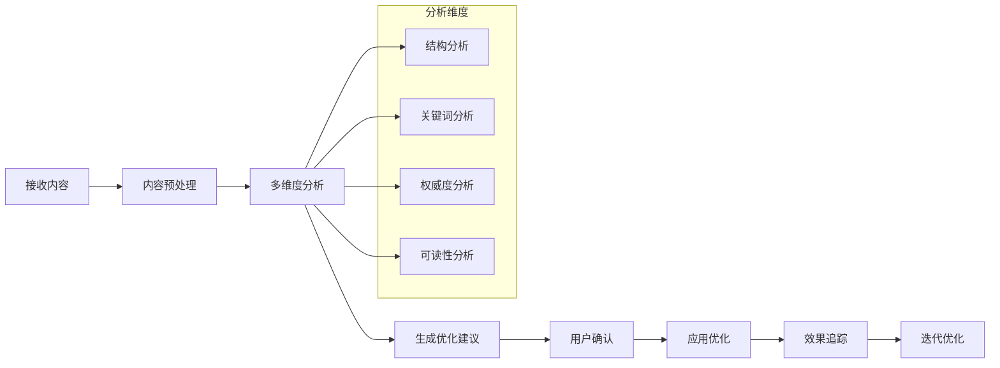
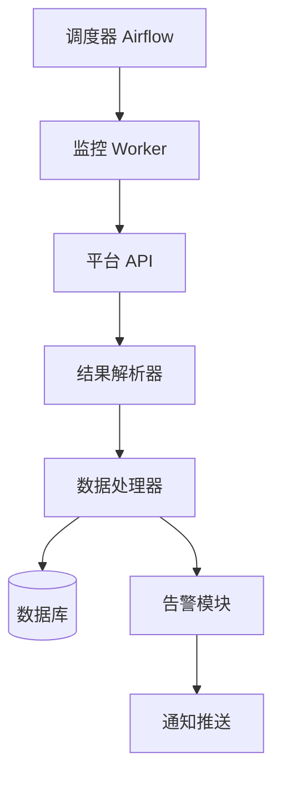

# GEO 商业平台 - 系统架构设计

| 版本 | 日期 | 作者 | 变更记录 |
|------|------|------|----------|
| v1.0 | 2026-05-21 | 架构团队 | 初始版本 |

---

## 1. 系统总体架构

### 1.1 架构视图



### 1.2 设计原则

- **微服务架构** - 按业务域拆分独立服务
- **高可用性** - 多副本部署、故障自动转移
- **可扩展性** - 水平扩展、弹性伸缩
- **安全性** - 零信任、分层防御
- **可观测性** - 日志、监控、追踪三位一体

---

## 2. 技术栈选型

### 2.1 前端技术栈

| 层级 | 技术选型 | 说明 |
|------|---------|------|
| 框架 | Next.js 14 | React 框架、SSR 支持 |
| UI 组件库 | shadcn/ui + Tailwind CSS | 现代化设计系统 |
| 状态管理 | Zustand | 轻量级状态管理 |
| 数据请求 | TanStack Query | 服务端状态管理 |
| 图表 | ECharts / Recharts | 数据可视化 |
| 富文本编辑 | TipTap | 现代富文本编辑器 |

### 2.2 后端技术栈

| 层级 | 技术选型 | 说明 |
|------|---------|------|
| 语言 | Python 3.11+ | 主业务逻辑 |
| Web 框架 | FastAPI | 高性能异步框架 |
| ORM | SQLAlchemy 2.0 | 类型安全的 ORM |
| 数据库 | PostgreSQL 15 | 主数据库 |
| 缓存 | Redis 7 | 缓存和会话 |
| 消息队列 | RabbitMQ / Redis Queue | 异步任务 |
| 搜索引擎 | Elasticsearch 8 | 全文搜索 |
| 时序数据库 | TimescaleDB / InfluxDB | 时序数据存储 |
| 对象存储 | MinIO / AWS S3 | 文件存储 |

### 2.3 GEO 引擎技术栈

| 组件 | 技术选型 | 说明 |
|------|---------|------|
| LLM 集成 | LangChain | 多 LLM 统一接口 |
| 向量数据库 | Pinecone / Milvus | 向量相似度搜索 |
| 内容分析 | spaCy / NLTK | NLP 处理 |
| 模型部署 | vLLM / TGI | 模型推理加速 |
| 监控调度 | Airflow | 定时任务调度 |

### 2.4 基础设施

| 组件 | 技术选型 | 说明 |
|------|---------|------|
| 容器化 | Docker + Kubernetes | 容器编排 |
| CI/CD | GitHub Actions / GitLab CI | 持续集成部署 |
| 监控 | Prometheus + Grafana | 监控告警 |
| 日志 | ELK Stack (Elasticsearch, Logstash, Kibana) | 日志收集分析 |
| 追踪 | Jaeger / OpenTelemetry | 分布式追踪 |
| 服务网格 | Istio | 服务治理 |

---

## 3. 数据库设计

### 3.1 核心实体关系图



### 3.2 关键表设计

#### 用户表 (users)

```sql
CREATE TABLE users (
    id UUID PRIMARY KEY DEFAULT gen_random_uuid(),
    email VARCHAR(255) UNIQUE NOT NULL,
    password_hash VARCHAR(255) NOT NULL,
    name VARCHAR(100),
    avatar_url VARCHAR(500),
    settings JSONB DEFAULT '{}',
    is_active BOOLEAN DEFAULT true,
    created_at TIMESTAMPTZ DEFAULT CURRENT_TIMESTAMP,
    updated_at TIMESTAMPTZ DEFAULT CURRENT_TIMESTAMP
);

CREATE INDEX idx_users_email ON users(email);
CREATE INDEX idx_users_created_at ON users(created_at);
```

#### 推广计划表 (campaigns)

```sql
CREATE TABLE campaigns (
    id UUID PRIMARY KEY DEFAULT gen_random_uuid(),
    user_id UUID NOT NULL REFERENCES users(id),
    name VARCHAR(200) NOT NULL,
    description TEXT,
    target_keywords JSONB DEFAULT '[]',
    target_platforms JSONB DEFAULT '[]',
    status VARCHAR(50) DEFAULT 'draft', -- draft, active, paused, completed
    config JSONB DEFAULT '{}',
    start_date TIMESTAMPTZ,
    end_date TIMESTAMPTZ,
    created_at TIMESTAMPTZ DEFAULT CURRENT_TIMESTAMP,
    updated_at TIMESTAMPTZ DEFAULT CURRENT_TIMESTAMP
);

CREATE INDEX idx_campaigns_user_id ON campaigns(user_id);
CREATE INDEX idx_campaigns_status ON campaigns(status);
CREATE INDEX idx_campaigns_created_at ON campaigns(created_at);
```

#### 内容表 (contents)

```sql
CREATE TABLE contents (
    id UUID PRIMARY KEY DEFAULT gen_random_uuid(),
    user_id UUID NOT NULL REFERENCES users(id),
    title VARCHAR(500) NOT NULL,
    content TEXT,
    content_type VARCHAR(50), -- article, webpage, pdf, etc.
    source_url VARCHAR(1000),
    metadata JSONB DEFAULT '{}',
    geo_score DECIMAL(5,2),
    created_at TIMESTAMPTZ DEFAULT CURRENT_TIMESTAMP,
    updated_at TIMESTAMPTZ DEFAULT CURRENT_TIMESTAMP
);

CREATE INDEX idx_contents_user_id ON contents(user_id);
CREATE INDEX idx_contents_geo_score ON contents(geo_score DESC);
CREATE INDEX idx_contents_created_at ON contents(created_at);
```

#### 排名记录表 (ranking_records)

```sql
CREATE TABLE ranking_records (
    id UUID PRIMARY KEY DEFAULT gen_random_uuid(),
    campaign_id UUID NOT NULL REFERENCES campaigns(id),
    content_id UUID REFERENCES contents(id),
    platform_id UUID NOT NULL REFERENCES platforms(id),
    keyword VARCHAR(500) NOT NULL,
    rank_position INTEGER,
    metrics JSONB DEFAULT '{}',
    recorded_at TIMESTAMPTZ DEFAULT CURRENT_TIMESTAMP
);

CREATE INDEX idx_ranking_campaign_id ON ranking_records(campaign_id);
CREATE INDEX idx_ranking_platform_id ON ranking_records(platform_id);
CREATE INDEX idx_ranking_recorded_at ON ranking_records(recorded_at DESC);
CREATE INDEX idx_ranking_keyword ON ranking_records(keyword);
```

---

## 4. API 设计

### 4.1 API 规范

- **协议**: HTTPS
- **格式**: JSON
- **认证**: JWT / OAuth2.0
- **版本**: `/api/v1/`

### 4.2 核心 API 接口

#### 认证模块

| 方法 | 路径 | 描述 |
|------|------|------|
| POST | `/api/v1/auth/register` | 用户注册 |
| POST | `/api/v1/auth/login` | 用户登录 |
| POST | `/api/v1/auth/logout` | 用户登出 |
| POST | `/api/v1/auth/refresh` | 刷新令牌 |
| GET | `/api/v1/auth/me` | 获取当前用户信息 |

#### 用户模块

| 方法 | 路径 | 描述 |
|------|------|------|
| GET | `/api/v1/users/profile` | 获取用户资料 |
| PUT | `/api/v1/users/profile` | 更新用户资料 |
| GET | `/api/v1/users/settings` | 获取用户设置 |
| PUT | `/api/v1/users/settings` | 更新用户设置 |

#### 推广计划模块

| 方法 | 路径 | 描述 |
|------|------|------|
| GET | `/api/v1/campaigns` | 获取计划列表 |
| POST | `/api/v1/campaigns` | 创建新计划 |
| GET | `/api/v1/campaigns/:id` | 获取计划详情 |
| PUT | `/api/v1/campaigns/:id` | 更新计划 |
| DELETE | `/api/v1/campaigns/:id` | 删除计划 |
| POST | `/api/v1/campaigns/:id/start` | 启动计划 |
| POST | `/api/v1/campaigns/:id/pause` | 暂停计划 |

#### 内容模块

| 方法 | 路径 | 描述 |
|------|------|------|
| GET | `/api/v1/contents` | 获取内容列表 |
| POST | `/api/v1/contents` | 上传新内容 |
| GET | `/api/v1/contents/:id` | 获取内容详情 |
| PUT | `/api/v1/contents/:id` | 更新内容 |
| DELETE | `/api/v1/contents/:id` | 删除内容 |
| POST | `/api/v1/contents/:id/analyze` | 分析内容 |
| POST | `/api/v1/contents/:id/optimize` | 优化内容 |

#### 平台集成模块

| 方法 | 路径 | 描述 |
|------|------|------|
| GET | `/api/v1/platforms` | 获取平台列表 |
| POST | `/api/v1/platforms/:id/bind` | 绑定平台 |
| DELETE | `/api/v1/platforms/:id/bind` | 解绑平台 |
| GET | `/api/v1/platforms/:id/status` | 获取平台状态 |

#### 分析报告模块

| 方法 | 路径 | 描述 |
|------|------|------|
| GET | `/api/v1/analytics/dashboard` | 仪表盘数据 |
| GET | `/api/v1/analytics/campaigns/:id` | 计划分析 |
| GET | `/api/v1/analytics/rankings` | 排名趋势 |
| GET | `/api/v1/analytics/export` | 导出报告 |

---

## 5. 微服务设计

### 5.1 服务划分

| 服务名称 | 职责 | 技术栈 |
|---------|------|--------|
| auth-service | 用户认证、权限管理 | FastAPI + JWT |
| user-service | 用户管理、组织管理 | FastAPI + PostgreSQL |
| content-service | 内容管理、内容分析 | FastAPI + PostgreSQL + S3 |
| campaign-service | 推广计划、任务调度 | FastAPI + PostgreSQL + Redis |
| platform-service | 平台集成、API 封装 | FastAPI + 外部 API |
| analytics-service | 数据分析、报表生成 | FastAPI + Elasticsearch |
| billing-service | 订阅管理、账单支付 | FastAPI + PostgreSQL |
| notification-service | 消息通知、推送 | FastAPI + Redis + WebSocket |

### 5.2 服务通信

- **同步通信**: gRPC / REST API
- **异步通信**: RabbitMQ / Kafka 消息队列
- **服务发现**: Kubernetes DNS / Consul
- **配置管理**: etcd / Kubernetes ConfigMap

---

## 6. GEO 引擎设计

### 6.1 内容优化流程



### 6.2 排名监控架构



---

## 7. 安全设计

### 7.1 安全架构层次

```
┌─────────────────────────────────────────┐
│         应用层安全                        │
│  - 输入验证、输出编码                    │
│  - CSRF、XSS 防护                        │
│  - 权限控制                              │
└─────────────────────────────────────────┘
┌─────────────────────────────────────────┐
│         服务层安全                        │
│  - API 认证、限流                        │
│  - 服务间通信加密                        │
│  - 审计日志                              │
└─────────────────────────────────────────┘
┌─────────────────────────────────────────┐
│         数据层安全                        │
│  - 数据加密存储                          │
│  - 备份和恢复                            │
│  - 数据脱敏                              │
└─────────────────────────────────────────┘
┌─────────────────────────────────────────┐
│         基础设施安全                      │
│  - 网络隔离                              │
│  - 主机加固                              │
│  - 安全补丁                              │
└─────────────────────────────────────────┘
```

### 7.2 数据加密

- **传输加密**: TLS 1.3
- **存储加密**: AES-256
- **密钥管理**: KMS / HashiCorp Vault
- **敏感字段**: 加密存储、访问审计

---

## 8. 部署架构

### 8.1 Kubernetes 部署

```yaml
# 简化的 Kubernetes 部署结构
geo-platform/
├── namespaces/
│   └── geo-platform.yaml
├── deployments/
│   ├── website.yaml
│   ├── client-app.yaml
│   ├── admin-app.yaml
│   ├── api-gateway.yaml
│   ├── auth-service.yaml
│   ├── user-service.yaml
│   └── ...
├── services/
│   ├── website.yaml
│   ├── client-app.yaml
│   └── ...
├── configmaps/
│   └── app-config.yaml
└── secrets/
    └── app-secrets.yaml
```

### 8.2 环境划分

| 环境 | 用途 | URL |
|------|------|-----|
| 开发环境 | 本地开发 | localhost:3000 |
| 测试环境 | 功能测试 | test.geo-platform.com |
| 预发布环境 | 回归验证 | staging.geo-platform.com |
| 生产环境 | 正式对外 | www.geo-platform.com |
