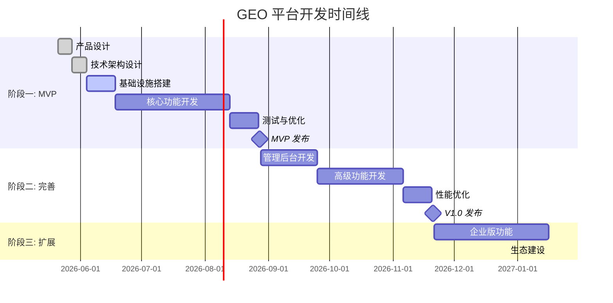
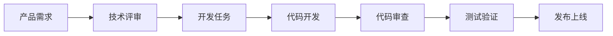

# GEO 商业平台 - 开发计划

| 版本 | 日期 | 作者 | 变更记录 |
|------|------|------|----------|
| v1.0 | 2026-05-21 | 项目管理团队 | 初始版本 |

---

## 1. 里程碑规划

### 1.1 总体时间线

---

## 2. 阶段一: MVP (最小可行产品)

### 2.1 目标

- 验证产品概念
- 获取早期用户反馈
- 建立核心技术架构

### 2.2 时间规划

- **总时长**: 12 周
- **开始时间**: 2026-05-21
- **发布时间**: 2026-08-15

### 2.3 MVP 功能范围

#### 官网 (Website)
- [ ] 首页展示
- [ ] 产品介绍页
- [ ] 价格套餐页
- [ ] 用户注册/登录
- [ ] 博客/帮助中心

#### 客户端 (Client App)
- [ ] 用户仪表盘
- [ ] 推广计划管理 (CRUD)
- [ ] 内容管理 (上传、编辑)
- [ ] 基础排名监控 (3 个平台)
- [ ] 简单数据报表
- [ ] 个人设置

#### 管理后台 (Admin - 基础版)
- [ ] 用户管理
- [ ] 套餐管理
- [ ] 基础数据统计

#### GEO 引擎 (核心)
- [ ] 内容基础分析
- [ ] 简单优化建议
- [ ] 排名监控 (ChatGPT, Gemini, Claude)
- [ ] 基础数据采集

### 2.4 里程碑 1.1 - 基础设施 (2 周)

**目标**: 搭建开发和部署基础设施

**任务清单**:
- [ ] 代码仓库初始化
- [ ] CI/CD 流水线搭建
- [ ] 开发环境配置 (Docker Compose)
- [ ] 数据库初始化和迁移脚本
- [ ] 基础 API 框架搭建
- [ ] 用户认证系统 (JWT)
- [ ] 监控和日志基础配置

**交付物**:
- 可运行的开发环境
- 基础工程化配置
- 团队开发规范文档

### 2.5 里程碑 1.2 - 官网开发 (2 周)

**目标**: 完成营销官网开发

**任务清单**:
- [ ] 官网 UI 设计实现
- [ ] 页面路由和布局
- [ ] 内容管理系统集成
- [ ] SEO 优化
- [ ] 响应式适配
- [ ] 性能优化

**交付物**:
- 可访问的官方网站
- CMS 后台

### 2.6 里程碑 1.3 - 客户端核心功能 (4 周)

**目标**: 完成 MVP 版本的客户端应用

**任务清单 - 第 1 周**:
- [ ] 仪表盘页面开发
- [ ] 用户认证页面
- [ ] 导航和布局
- [ ] 状态管理配置

**任务清单 - 第 2 周**:
- [ ] 推广计划列表页
- [ ] 创建/编辑计划页面
- [ ] 计划详情页面
- [ ] 计划状态管理

**任务清单 - 第 3 周**:
- [ ] 内容列表页面
- [ ] 内容上传功能
- [ ] 内容编辑器
- [ ] 内容分析展示

**任务清单 - 第 4 周**:
- [ ] 排名监控展示
- [ ] 基础图表可视化
- [ ] 数据导出功能
- [ ] 用户设置页面

### 2.7 里程碑 1.4 - GEO 引擎核心 (3 周)

**目标**: 实现 GEO 核心功能

**任务清单**:
- [ ] 平台 API 集成 (OpenAI, Google, Anthropic)
- [ ] 内容分析模块
- [ ] 优化建议生成
- [ ] 排名监控调度器
- [ ] 数据采集和存储

### 2.8 里程碑 1.5 - 测试与发布 (1 周)

**目标**: 完成测试并发布 MVP

**任务清单**:
- [ ] 功能测试
- [ ] 性能测试
- [ ] 安全测试
- [ ] Bug 修复
- [ ] 文档完善
- [ ] 部署上线

---

## 3. 阶段二: V1.0 完整版

### 3.1 目标

- 完善所有核心功能
- 完整的管理后台
- 优化用户体验

### 3.2 时间规划

- **总时长**: 12 周
- **开始时间**: MVP 发布后
- **发布时间**: 2026-11-15

### 3.3 V1.0 功能范围

#### 客户端增强
- [ ] AI 助手功能
- [ ] 高级数据分析
- [ ] A/B 测试功能
- [ ] 团队协作功能
- [ ] 高级报表和导出

#### 管理后台完整版
- [ ] 销售管理模块
- [ ] 内容运营模块
- [ ] 客户运营模块
- [ ] 财务管理模块
- [ ] 系统设置模块
- [ ] 完整权限体系 (RBAC)

#### GEO 引擎增强
- [ ] 更智能的优化算法
- [ ] 更多平台支持 (10+)
- [ ] 竞品分析功能
- [ ] 趋势预测
- [ ] 自动优化执行

---

## 4. 阶段三: 企业版与生态

### 4.1 目标

- 推出企业版功能
- 建立开发者生态
- 拓展平台合作

### 4.2 企业版功能

- [ ] SSO 单点登录
- [ ] 审计日志
- [ ] SLA 保障
- [ ] API 访问
- [ ] 私有化部署支持
- [ ] 专属客户经理

### 4.3 生态建设

- [ ] 开发者文档
- [ ] SDK 发布 (Python, JavaScript, Java)
- [ ] 合作伙伴 API
- [ ] 插件市场
- [ ] 社区建设

---

## 5. 团队配置

### 5.1 MVP 阶段团队

| 角色 | 人数 | 职责 |
|------|------|------|
| 产品经理 | 1 | 需求管理、产品规划 |
| UI/UX 设计师 | 1 | 界面设计、用户体验 |
| 前端开发 | 2 | 官网、客户端、管理后台 |
| 后端开发 | 2 | API、业务逻辑、引擎开发 |
| 全栈开发 | 1 | 补位、技术选型 |
| DevOps | 1 | 基础设施、CI/CD |
| 测试工程师 | 1 | 质量保证 |

### 5.2 团队协作流程

---

## 6. 风险管理

### 6.1 技术风险

| 风险 | 概率 | 影响 | 缓解措施 |
|------|------|------|---------|
| 第三方 API 变更 | 中 | 高 | 抽象层设计、备用方案 |
| 性能瓶颈 | 中 | 中 | 早期压力测试、架构优化 |
| 数据安全问题 | 低 | 高 | 安全审计、加密存储 |

### 6.2 进度风险

| 风险 | 概率 | 影响 | 缓解措施 |
|------|------|------|---------|
| 需求变更 | 高 | 中 | MVP 范围锁定、变更管理 |
| 人员流动 | 低 | 高 | 知识共享、文档完善 |
| 技术难点 | 中 | 高 | 技术预研、专家咨询 |

---

## 7. 质量保障

### 7.1 代码质量

- [ ] 代码审查流程 (Code Review)
- [ ] 单元测试覆盖 > 70%
- [ ] 集成测试覆盖核心流程
- [ ] E2E 测试关键路径

### 7.2 性能指标

- [ ] 页面加载 < 2s
- [ ] API 响应 < 500ms
- [ ] 支持 1000+ 并发用户
- [ ] 99.9% 系统可用性

---

## 8. 上线检查清单

### MVP 发布检查清单

- [ ] 所有核心功能完成
- [ ] 测试覆盖达标
- [ ] 性能测试通过
- [ ] 安全审计通过
- [ ] 用户文档完成
- [ ] 运维手册完成
- [ ] 监控告警配置
- [ ] 回滚方案准备
- [ ] 首屏性能优化
- [ ] SEO 基础优化
