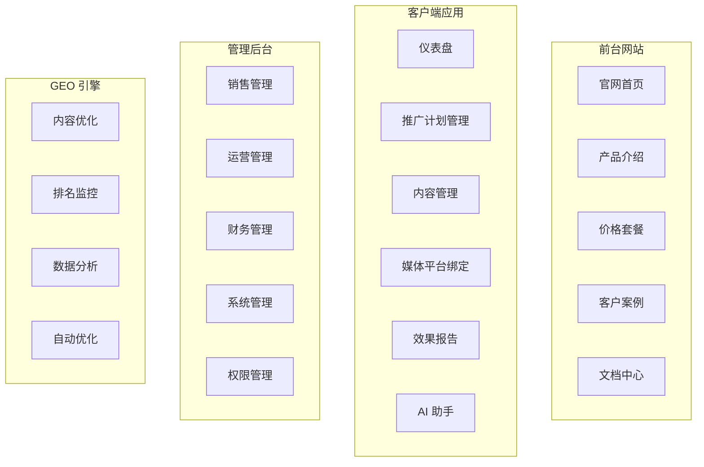
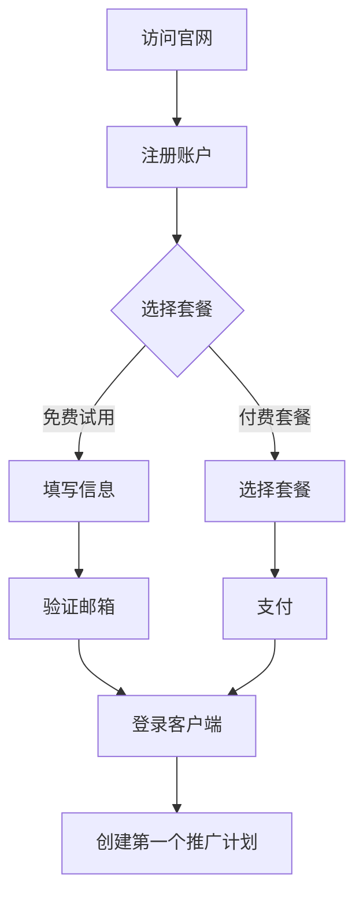
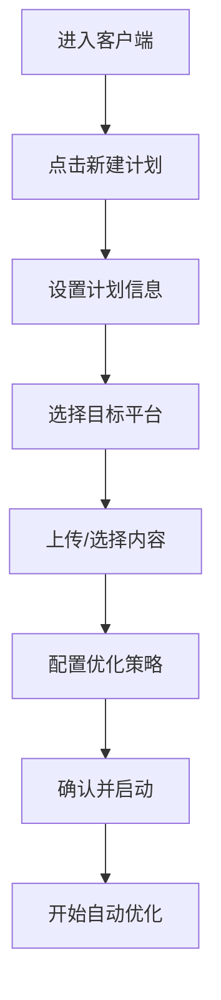
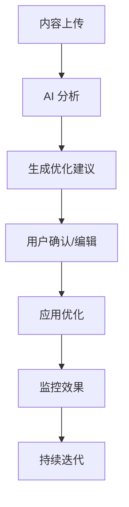

# GEO 商业平台 - 产品需求文档 (PRD)

| 版本 | 日期 | 作者 | 变更记录 |
|------|------|------|----------|
| v1.0 | 2026-05-21 | 产品团队 | 初始版本 |

---

## 1. 产品概述

### 1.1 产品定位

**GEO 商业平台**是专业的生成式搜索引擎优化（Generative Engine Optimization）商业化平台，专注于帮助企业和内容创作者实现长期稳定的 GEO 过程。

### 1.2 核心理念

> **"一次营销推广，必须有一个长期稳定的 GEO 过程"**

### 1.3 目标用户

| 用户群体 | 核心需求 | 关键场景 |
|---------|---------|---------|
| 企业市场部 | 品牌内容在 AI 搜索中的可见度 | 产品发布、品牌营销 |
| 内容创作者 | 个人/专业内容优化 | 博客、知识库、技术文档 |
| 电商商家 | 产品内容 GEO 优化 | 商品详情页、评价 |
| 数字营销代理 | 多客户 GEO 管理 | 批量客户运营、报表 |

### 1.4 商业价值

1. **抢占 AI 搜索流量入口** - 先于竞争对手布局 GEO
2. **长期稳定的效果** - 不同于传统 SEO 的短期波动
3. **数据化管理** - 完整的效果追踪和 ROI 分析
4. **团队协作** - 多角色权限管理

---

## 2. 产品功能架构

### 2.1 系统功能模块图



---

## 3. 功能需求详细设计

### 3.1 前台官网 - 功能说明

#### 3.1.1 首页

| 功能点 | 描述 | 优先级 |
|--------|------|--------|
| Hero 区域 | 产品价值主张、CTA 按钮 | P0 |
| 核心功能 | 4-6 个核心功能卡片展示 | P0 |
| 用户见证 | 真实客户案例/评价 | P1 |
| 数据展示 | 平台关键数据指标（如优化内容量、覆盖平台数） | P1 |
| 合作伙伴 | 集成的 AI 平台 Logo | P2 |
| FAQ | 常见问题解答 | P2 |

#### 3.1.2 产品介绍页

| 功能点 | 描述 | 优先级 |
|--------|------|--------|
| 功能详解 | 每个核心功能的详细说明 | P0 |
| 工作原理 | GEO 优化流程可视化 | P1 |
| 适用场景 | 不同行业/用户的使用场景 | P1 |
| 对比分析 | GEO vs SEO、传统营销对比 | P2 |

#### 3.1.3 价格套餐页

| 功能点 | 描述 | 优先级 |
|--------|------|--------|
| 套餐展示 | 3-4 个阶梯套餐卡片 | P0 |
| 套餐对比 | 功能对比表格 | P0 |
| 年付优惠 | 年付折扣展示 | P1 |
| 试用入口 | 免费试用申请 | P0 |
| 自定义套餐 | 企业定制询价 | P2 |

**价格套餐建议**：

| 套餐 | 价格（月） | 核心权益 |
|------|-----------|---------|
| 入门版 | ¥299 | 5 个推广计划、3 个平台监控、基础报告 |
| 专业版 | ¥999 | 20 个推广计划、10 个平台、高级分析 |
| 企业版 | ¥2999 | 无限计划、全部平台、专属客户经理 |
| 定制版 | 询价 | 私有化部署、API 访问、SLA 保障 |

#### 3.1.4 客户案例页

| 功能点 | 描述 | 优先级 |
|--------|------|--------|
| 案例列表 | 按行业分类的案例展示 | P1 |
| 案例详情 | 完整的客户成功故事 | P1 |
| 数据成果 | 优化前后的对比数据 | P1 |

#### 3.1.5 文档中心

| 功能点 | 描述 | 优先级 |
|--------|------|--------|
| 入门指南 | 新用户快速上手 | P1 |
| API 文档 | 开发者接口文档 | P2 |
| 最佳实践 | GEO 优化技巧 | P1 |
| 更新日志 | 产品更新记录 | P2 |

---

### 3.2 客户端 - 功能说明

#### 3.2.1 仪表盘

| 功能点 | 描述 | 优先级 |
|--------|------|--------|
| 概览卡片 | 今日数据、总体趋势 | P0 |
| 排名进度 | 各平台排名阶梯图 | P0 |
| 活跃计划 | 当前进行中的推广计划 | P0 |
| 快速操作 | 新建计划、快速优化入口 | P1 |
| 通知中心 | 重要事件通知 | P1 |

**仪表盘数据展示**：
```
┌─────────────────────────────────────────────────────────┐
│  概览数据                                               │
│  ┌──────────┐  ┌──────────┐  ┌──────────┐  ┌────────┐ │
│  │ 内容数   │  │ 优化次数 │  │ 排名提升 │  │ 曝光   │ │
│  │  1,234   │  │   567    │  │   +42%   │  │  89k   │ │
│  └──────────┘  └──────────┘  └──────────┘  └────────┘ │
├─────────────────────────────────────────────────────────┤
│  排名阶梯进度                                           │
│  ┌──────────────────────────────────────────────────┐  │
│  │ ChatGPT: ████████░░░░ 8/10 → Top 3               │  │
│  │ Gemini:  ██████░░░░░░ 6/10 → Top 5               │  │
│  │ Claude:  ████████████░ 12/10 → Top 1 ✓          │  │
│  └──────────────────────────────────────────────────┘  │
├─────────────────────────────────────────────────────────┤
│  活跃推广计划 (3)                                       │
│  ┌──────────┐ ┌──────────┐ ┌──────────┐              │
│  │ 计划A    │ │ 计划B    │ │ 计划C    │              │
│  │ 进行中   │ │ 进行中   │ │ 进行中   │              │
│  └──────────┘ └──────────┘ └──────────┘              │
└─────────────────────────────────────────────────────────┘
```

#### 3.2.2 推广计划管理

| 功能点 | 描述 | 优先级 |
|--------|------|--------|
| 计划列表 | 所有推广计划的管理视图 | P0 |
| 创建计划 | 新建 GEO 推广计划 | P0 |
| 计划详情 | 单个计划的完整信息 | P0 |
| 计划编辑 | 修改计划配置 | P0 |
| 暂停/恢复 | 控制计划执行状态 | P0 |
| 复制计划 | 基于已有计划快速创建 | P1 |

**创建推广计划流程**：
```
1. 设置基本信息
   ├─ 计划名称
   ├─ 目标关键词/问题
   └─ 目标平台（多选）

2. 上传/选择内容
   ├─ 已有内容选择
   └─ 新内容上传

3. 配置优化策略
   ├─ 优化频率（每日/每周/每月）
   ├─ 优化目标（排名/曝光/引用）
   └─ 预算设置

4. 确认并启动
```

#### 3.2.3 内容管理

| 功能点 | 描述 | 优先级 |
|--------|------|--------|
| 内容库 | 所有内容的统一管理 | P0 |
| 内容上传 | 支持多种格式（文章、网页、PDF 等） | P0 |
| 内容编辑 | 在线编辑优化建议 | P0 |
| 版本历史 | 内容优化历史记录 | P1 |
| A/B 测试 | 不同版本对比测试 | P2 |
| 内容评分 | AI 评估内容 GEO 友好度 | P1 |

**内容评分维度**：
- 结构清晰度 (1-10)
- 关键词覆盖 (1-10)
- 信息完整度 (1-10)
- 权威度信号 (1-10)
- 综合推荐指数 (1-100)

#### 3.2.4 媒体平台绑定

| 功能点 | 描述 | 优先级 |
|--------|------|--------|
| 平台列表 | 支持的所有 AI 平台 | P0 |
| 绑定管理 | 添加/移除平台绑定 | P0 |
| 权限配置 | 平台访问权限设置 | P1 |
| 状态监控 | 平台连接状态 | P1 |

**支持的平台**：
- ChatGPT (OpenAI)
- Gemini (Google)
- Claude (Anthropic)
- Perplexity
- 百度文心一言
- 阿里通义千问
- 讯飞星火
- 更多平台持续接入...

#### 3.2.5 效果报告

| 功能点 | 描述 | 优先级 |
|--------|------|--------|
| 实时看板 | 当前排名和表现 | P0 |
| 趋势分析 | 历史数据趋势图 | P0 |
| 平台对比 | 多平台表现对比 | P1 |
| 导出报告 | PDF/Excel 报告导出 | P1 |
| 自定义报表 | 用户自定义报表维度 | P2 |
| ROI 分析 | 投入产出分析 | P1 |

**报告数据维度**：
- 排名变化趋势
- 引用频率统计
- 曝光量估算
- 关键词覆盖
- 竞品对比

#### 3.2.6 AI 助手

| 功能点 | 描述 | 优先级 |
|--------|------|--------|
| 优化建议 | AI 自动生成优化建议 | P0 |
| 内容改写 | AI 辅助内容改写 | P0 |
| 问答指导 | 如何让内容更容易被引用 | P1 |
| 策略咨询 | GEO 策略建议 | P2 |

---

### 3.3 管理后台 - 功能说明

#### 3.3.1 销售管理

| 功能点 | 描述 | 优先级 | 角色 |
|--------|------|--------|------|
| 客户管理 | 客户信息全生命周期管理 | P0 | 销售、销售管理 |
| 线索跟进 | 销售线索分配和跟进 | P0 | 销售、销售管理 |
| 订单管理 | 订单创建、审批、执行 | P0 | 销售、财务 |
| 合同管理 | 电子合同签署和管理 | P1 | 销售、财务 |
| 销售报表 | 销售业绩分析报表 | P0 | 销售管理 |

#### 3.3.2 运营管理

**3.3.2.1 内容运营**

| 功能点 | 描述 | 优先级 |
|--------|------|--------|
| 内容审核 | 客户内容质量审核 | P1 |
| 优化策略 | 全局优化策略配置 | P0 |
| 最佳实践 | 运营最佳实践库 | P1 |
| 模板管理 | 内容优化模板 | P1 |

**3.3.2.2 客户运营**

| 功能点 | 描述 | 优先级 |
|--------|------|--------|
| 客户分层 | 客户价值分层管理 | P1 |
| 生命周期 | 客户生命周期管理 | P1 |
| 活动运营 | 营销活动策划执行 | P2 |
| 健康度检查 | 客户使用情况监控 | P1 |

**3.3.2.3 销售管理**

| 功能点 | 描述 | 优先级 |
|--------|------|--------|
| 团队管理 | 销售团队组织架构 | P0 |
| 目标管理 | 销售目标设定追踪 | P1 |
| 绩效管理 | 销售业绩绩效考核 | P1 |
| 佣金计算 | 销售佣金自动计算 | P2 |

#### 3.3.3 财务管理

| 功能点 | 描述 | 优先级 |
|--------|------|--------|
| 账单管理 | 账单生成、发送、催收 | P0 |
| 支付记录 | 所有支付流水记录 | P0 |
| 发票管理 | 发票申请和开具 | P1 |
| 退款处理 | 退款申请和审批 | P1 |
| 财务报表 | 收入、成本、利润报表 | P0 |
| 套餐配置 | 价格套餐管理 | P1 |

#### 3.3.4 系统管理

| 功能点 | 描述 | 优先级 |
|--------|------|--------|
| 用户管理 | 系统用户账户管理 | P0 |
| 角色权限 | RBAC 权限配置 | P0 |
| 操作日志 | 系统操作审计日志 | P0 |
| 系统配置 | 全局系统参数设置 | P1 |
| API 管理 | API 密钥和配额管理 | P1 |

#### 3.3.5 权限控制矩阵

| 功能模块 | 超级管理员 | 销售总监 | 销售 | 运营总监 | 内容运营 | 客户运营 | 财务 |
|---------|-----------|---------|------|---------|---------|---------|------|
| 客户管理 | ✓ | ✓ | ✓ | | | | |
| 订单管理 | ✓ | ✓ | ✓ | | | | ✓ |
| 内容审核 | ✓ | | | ✓ | ✓ | | |
| 财务管理 | ✓ | | | | | | ✓ |
| 系统设置 | ✓ | | | | | | |
| 数据报表 | ✓ | ✓ | ✓ | ✓ | ✓ | ✓ | ✓ |

---

### 3.4 GEO 核心引擎

#### 3.4.1 内容优化引擎

| 功能点 | 描述 |
|--------|------|
| 内容分析 | 分析现有内容的 GEO 潜力 |
| 优化建议 | 生成具体的可操作优化建议 |
| 自动改写 | AI 辅助内容自动优化 |
| 格式优化 | 优化内容结构和格式 |

#### 3.4.2 排名监控引擎

| 功能点 | 描述 |
|--------|------|
| 多平台监控 | 同时监控多个 AI 平台 |
| 关键词追踪 | 目标关键词排名追踪 |
| 引用检测 | 检测内容被 AI 引用情况 |
| 竞品分析 | 竞品内容表现对比 |

#### 3.4.3 数据分析引擎

| 功能点 | 描述 |
|--------|------|
| 趋势预测 | 基于历史数据预测趋势 |
| 归因分析 | 效果归因分析 |
| 异常检测 | 异常数据检测告警 |
| 智能建议 | 基于数据的优化建议 |

---

## 4. 用户流程设计

### 4.1 新用户注册流程



### 4.2 创建推广计划流程



### 4.3 内容优化流程



---

## 5. 商业化设计

### 5.1 收入模式

| 模式 | 说明 |
|------|------|
| 订阅制 | 主要收入来源，按月/年付费 |
| 按量计费 | 超额使用按量付费 |
| 增值服务 | 人工咨询、定制优化 |
| API 调用 | 开发者 API 调用收费 |
| 企业版 | 私有化部署、定制开发 |

### 5.2 客户生命周期价值 (LTV)

| 阶段 | 目标 | 关键动作 |
|------|------|---------|
| 获取期 | 降低获客成本 | 内容营销、免费试用 |
| 激活期 | 快速体验价值 | 新手引导、快速上手 |
| 留存期 | 提升用户粘性 | 持续价值、社区运营 |
| 变现期 | 提高 ARPU | 向上销售、交叉销售 |
| 推荐期 | 口碑传播 | 推荐奖励、案例宣传 |

### 5.3 运营指标

| 指标类别 | 关键指标 | 目标值 |
|---------|---------|--------|
| 增长指标 | DAU/MAU | 持续增长 |
| | 注册转化率 | > 30% |
| | 付费转化率 | > 10% |
| 收入指标 | MRR | 月度目标 |
| | ARPU | ¥300+ |
| | LTV:CAC | > 3:1 |
| 健康指标 | 留存率 (7天) | > 40% |
| | 留存率 (30天) | > 20% |
| | NPS | > 30 |

---

## 6. 非功能需求

### 6.1 性能需求

| 指标 | 要求 |
|------|------|
| 页面加载时间 | < 2s |
| API 响应时间 | < 500ms |
| 并发用户数 | 支持 10,000+ 并发 |
| 系统可用性 | 99.9% |

### 6.2 安全需求

- 数据加密（传输和存储）
- 权限隔离
- 审计日志
- GDPR/个人信息保护合规
- API 密钥安全管理

### 6.3 可扩展性

- 支持水平扩展
- 模块化设计
- 插件化架构支持新平台接入

---

## 7. 成功指标

### 7.1 MVP 成功标准

- [ ] 100 个付费用户
- [ ] 月留存率 > 25%
- [ ] 用户满意度 NPS > 20
- [ ] 平均优化效果 > 30% 提升

### 7.2 长期目标

- [ ] 10,000+ 企业客户
- [ ] 市场份额 > 15%
- [ ] 成为 GEO 领域标准

---

## 8. 风险与应对

| 风险 | 影响 | 概率 | 应对措施 |
|------|------|------|---------|
| AI 平台算法变更 | 高 | 中 | 快速迭代优化算法 |
| 竞品进入 | 中 | 高 | 建立技术壁垒和生态 |
| 用户理解成本 | 中 | 中 | 加强教育和引导 |
| 数据隐私问题 | 高 | 低 | 合规设计、透明沟通 |
